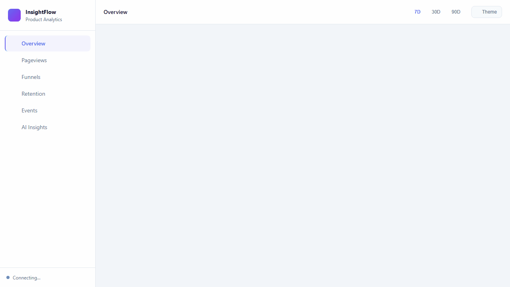
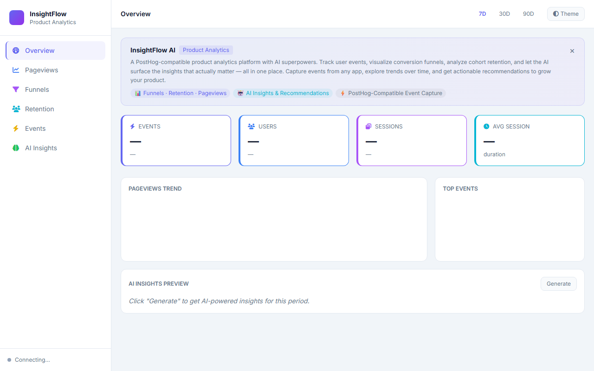
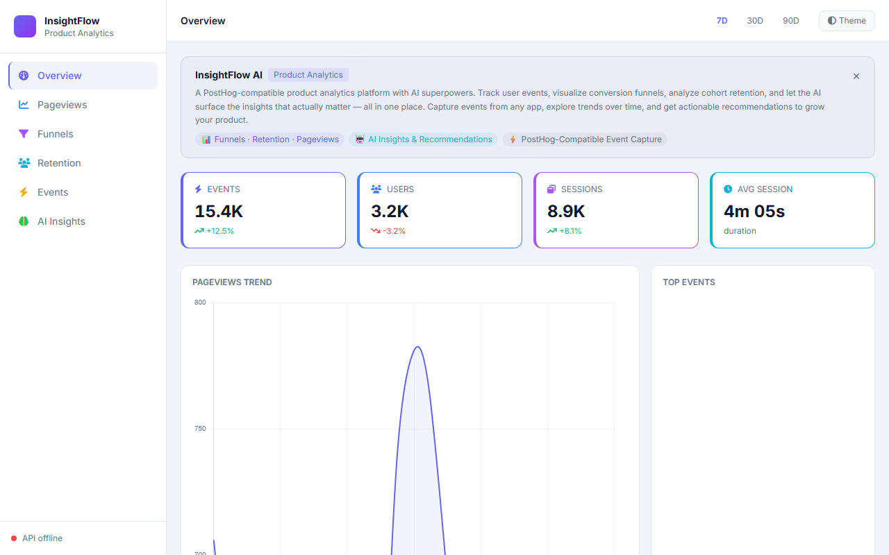
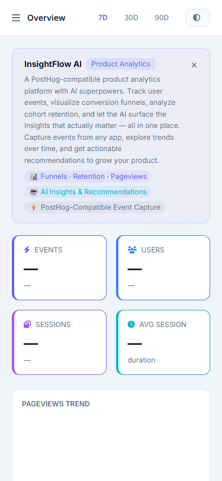

# InsightFlow AI

[](https://github.com/isidhartha/insightflow-ai/discussions)

## Demo



### Screenshots

| Desktop | Feature View | Mobile |
|---------|-------------|--------|
|  |  |  |


I wanted analytics for a side project but didn't want to hand my users' data to a third party, and I didn't want to pay for PostHog's cloud plan. So I built InsightFlow — a self-hosted product analytics platform with an AI layer that actually tells you what the data means.

The difference from standard analytics is the AI insights feature. Most analytics dashboards show you numbers and leave the interpretation to you. InsightFlow looks at your data and tells you things like "users who land on the pricing page from Google have a 3x higher conversion rate than those from social media" or "your retention drops off sharply at day 7 — here's a hypothesis about why." Those observations take an analyst hours to find manually. The AI surfaces them in seconds.

---

## What it does

**Event tracking** — Drop a single JavaScript snippet into your site and it starts capturing pageviews, clicks, form submissions, and custom events. Session tracking and anonymous user identification are handled automatically.

**User analytics** — Unique visitors, session counts, pageview trends over time. Filter by date range, country, browser, referrer. The dashboard updates in real time.

**Funnel analysis** — Define a series of steps (landing page → signup → onboarding → activation) and see where users drop off. Conversion rates at each step with the ability to segment by cohort.

**Retention tables** — Cohort-based retention analysis. See what percentage of users who signed up in a given week came back in week 2, week 3, and so on. This is the chart that tells you if your product actually has stickiness.

**Click heatmaps** — Visual overlay showing where users click on each page. Helps you understand whether people are actually interacting with what you think they're interacting with.

**AI insights** — Runs across your data every day and generates observations and recommendations. Not just "traffic is up 20%" but "traffic is up 20%, mostly from organic search, concentrated on three pages — here's what they have in common."

**Anomaly detection** — Flags unusual patterns in your metrics automatically. If your conversion rate drops 40% on a Tuesday, you'll know about it.

---

## How to run it

**Prerequisites**: Docker and Docker Compose. An OpenAI API key for the AI insights.

**1. Clone the repo**

```bash
git clone https://github.com/isidhartha/insightflow-ai.git
cd insightflow-ai
```

**2. Configure**

```bash
cp .env.example .env
```

Open `.env` and add your API key:

```
OPENAI_API_KEY=sk-your-key-here
```

**3. Start everything**

```bash
docker-compose up --build
```

**4. Load sample data** (optional but useful for seeing what the dashboard looks like with real numbers)

```bash
docker-compose exec backend python scripts/seed_data.py
```

This generates 2000 realistic analytics events across a simulated user base.

**5. Open the dashboard**

Go to `http://localhost:3000`.

---

## Adding the tracker to your site

Once you have InsightFlow running, tracking your site is two lines:

```html
<script src="http://your-insightflow-host:8000/tracker/insightflow.js"></script>
<script>
  InsightFlow.init('your-project-api-key');
</script>
```

After that, pageviews track automatically. For custom events:

```javascript
InsightFlow.capture('button_clicked', { button: 'upgrade_plan', page: '/pricing' });
InsightFlow.capture('form_submitted', { form: 'signup', source: 'landing_page' });
```

The tracker handles session management, deduplication, and offline buffering. It's about 8KB minified.

---

## API

Swagger UI at `http://localhost:8000/docs`.

```
POST /api/v1/capture              — Receive an analytics event
GET  /api/v1/analytics/overview   — Dashboard summary stats
GET  /api/v1/analytics/funnels    — Funnel analysis
GET  /api/v1/analytics/retention  — Retention cohort table
GET  /api/v1/analytics/heatmap    — Click heatmap data
POST /api/v1/ai/insights          — Generate AI insights for a date range
GET  /api/v1/ai/insights          — Retrieve saved insights
```

---

## Free local LLM option (no API key needed)

You can run the AI insights feature entirely on your own machine using [Ollama](https://ollama.com) — no OpenAI account or API key required.

1. Install Ollama from https://ollama.com
2. Pull the model: `ollama pull llama3.2`
3. In your `.env`, set `LLM_PROVIDER=ollama` (leave `OPENAI_API_KEY` blank)
4. Start the platform as normal: `docker-compose up --build`

Ollama runs the model locally on your CPU/GPU. Response times will be slower than the OpenAI API depending on your hardware, but there is no cost and no data leaves your machine. To switch back to OpenAI, set `LLM_PROVIDER=openai` and add your key.

To run Ollama as a Docker container alongside the other services, uncomment the `ollama` service block in `docker-compose.yml`.

---

## InsightFlow vs. alternatives

| Feature | InsightFlow AI | PostHog | Plausible |
|---|---|---|---|
| AI-generated insights | Yes | No | No |
| Self-hosted | Yes | Yes | Yes |
| Funnel analysis | Yes | Yes | No |
| Retention tables | Yes | Yes | No |
| Heatmaps | Yes | Yes | No |
| Open source | Yes | Yes | Yes |
| Cost | Free | Paid cloud | Paid cloud |

---

## Configuration

| Variable | Description | Default |
|---|---|---|
| `OPENAI_API_KEY` | For AI insights generation | — |
| `DATABASE_URL` | PostgreSQL connection string | see `.env.example` |
| `REDIS_URL` | Redis for caching | `redis://redis:6379` |
| `INSIGHT_GENERATION_INTERVAL` | How often AI insights run (hours) | `24` |

---

## License

MIT. Self-host it, fork it, build your own analytics product on top of it.
