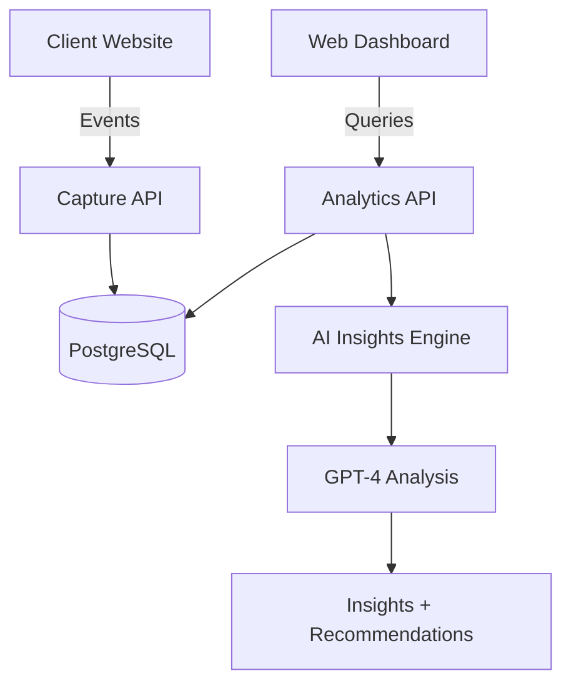

# InsightFlow AI — AI-Powered Product Analytics Platform

> Track user behavior, build conversion funnels, analyze retention — with AI-generated insights and recommendations.

[](LICENSE)
[](https://python.org)

## Features

- [x] Event tracking API (drop-in JavaScript tracker)
- [x] User analytics (sessions, pageviews, unique visitors)
- [x] Funnel analysis with conversion rates
- [x] Cohort retention tables
- [x] Click heatmap visualization
- [x] AI-generated business insights
- [x] AI product recommendations
- [x] Anomaly detection on metrics
- [x] Custom dashboards

## Quick Start

### 1. Start the platform

```bash
git clone https://github.com/yourusername/insightflow-ai
cd insightflow-ai
cp .env.example .env
docker-compose up --build
# Seed sample data:
docker-compose exec backend python scripts/seed_data.py
```

Open `http://localhost:3000`.

### 2. Add tracking to your site

```html
<script src="http://localhost:8000/tracker/insightflow.js"></script>
<script>
  InsightFlow.init('your-project-api-key');
  InsightFlow.capture('page_view', { page: '/home' });
</script>
```

## Architecture



## vs. Alternatives

| Feature | InsightFlow AI | PostHog | Plausible |
|---------|---------------|---------|-----------|
| AI Insights | ✅ | ❌ | ❌ |
| Self-hosted | ✅ | ✅ | ✅ |
| Funnel Analysis | ✅ | ✅ | ❌ |
| Retention Tables | ✅ | ✅ | ❌ |
| Heatmaps | ✅ | ✅ | ❌ |
| Open Source | ✅ | ✅ | ✅ |

## License

MIT — see [LICENSE](LICENSE).
